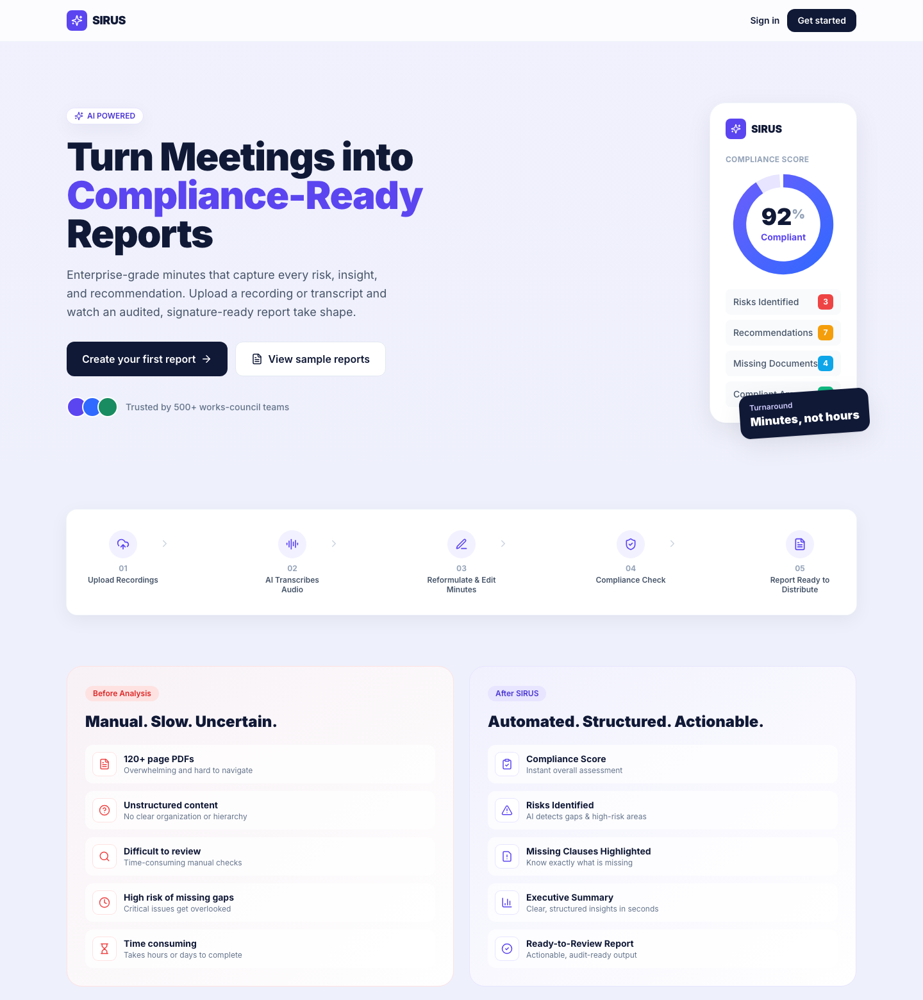
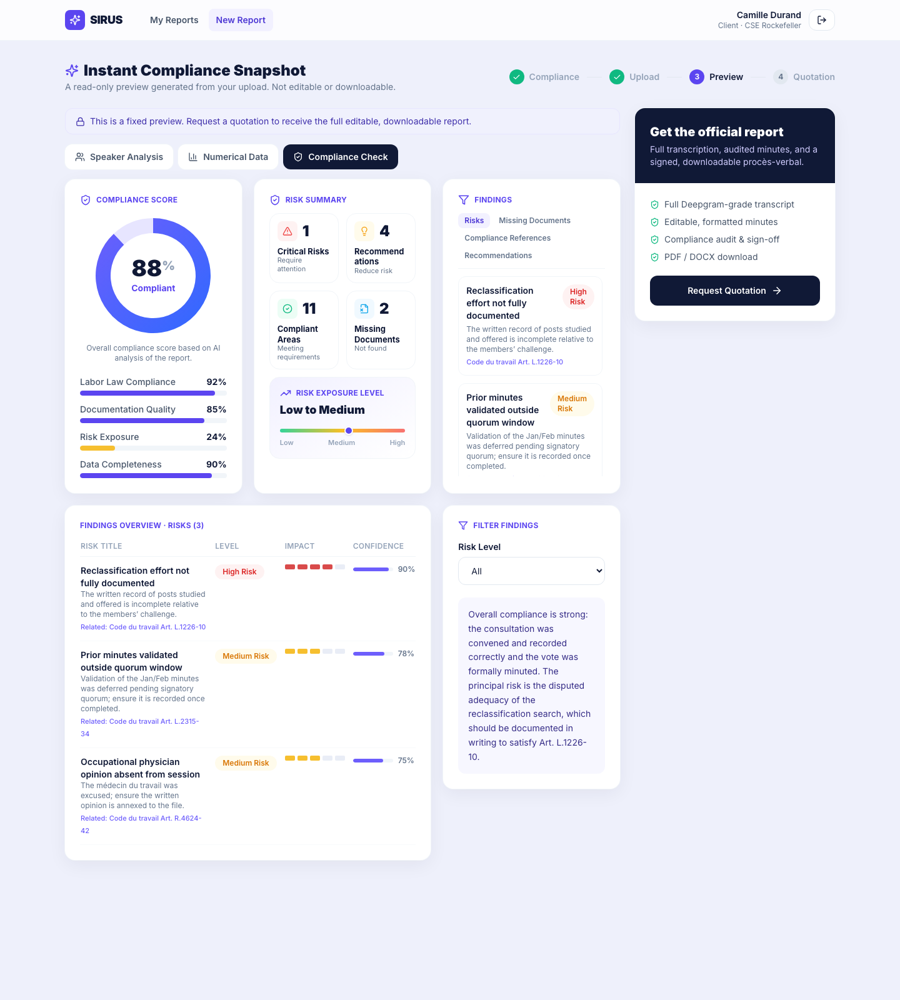
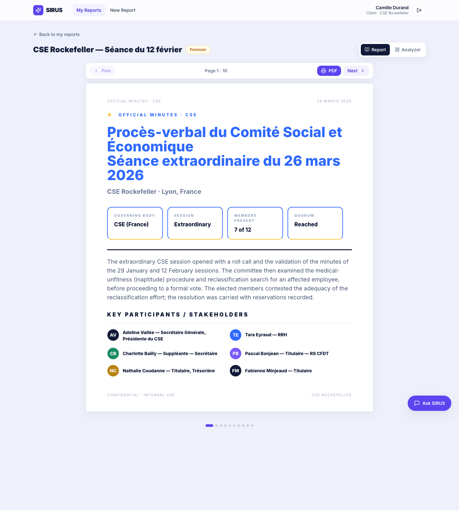
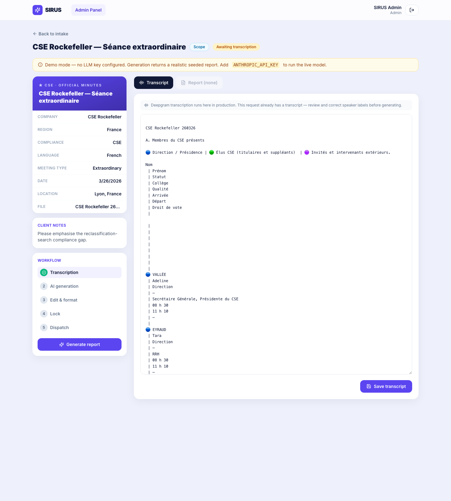

# SIRUS — AI Meeting-Minutes & Compliance Report Platform

Turn a raw meeting **transcript** into a **compliance-ready, signed procès-verbal** using AI — with a live compliance score, risk findings, and a page-based e-book report — then deliver it through a full client + admin workflow.

Built as a **MERN** application (MongoDB · Express · React · Node) for the Styleit Full-Stack intern assignment. The heart of the product is the pipeline **transcript → LLM → structured report → blue-design e-book viewer**, wrapped in a polished, responsive UI.

---

## ✨ Highlights

- **Real AI pipeline** — the backend sends the meeting transcript to an LLM (Claude / DeepSeek), which returns a validated JSON "report model". The server then **deterministically renders** that JSON into pixel-faithful HTML using the provided blue design system — so the output never drifts from the design, and the same data powers the compliance dashboard.
- **Two full sides** — a client journey (register → metadata → upload → instant 3-pattern preview → quotation) and an admin panel (folder-per-client intake → transcript editing → AI generation → page-based document editor → lock → dispatch).
- **Works with zero setup** — no API key? The pipeline returns a realistic **seeded** report so the entire flow is demoable offline. Add a key and it runs the live model.
- **Faithful to the brief** — the generated minutes reproduce the supplied `Report_Design_Template Blue.html`; the compliance dashboard reproduces the reference "Report Analyzer" screen.

## 📸 Screenshots

| | |
|---|---|
| **Homepage** — hero, before/after, sample library |  |
| **Report Analyzer** — compliance dashboard |  |
| **Generated minutes** — blue-design e-book viewer |  |
| **Admin** — intake, transcript editor, workflow |  |

(More in [`docs/screenshots/`](docs/screenshots/).)

## 🔑 Demo accounts

After seeding (see below), sign in with:

| Role | Email | Password |
|---|---|---|
| **Client** | `client@sirus.app` | `password123` |
| **Admin** | `admin@sirus.app` | `password123` |

The login screen also has one-click buttons to fill these in.

---

## 🚀 Run it locally

**Prerequisites:** Node 18+ and a MongoDB instance (local `mongod`, or a free [MongoDB Atlas](https://www.mongodb.com/atlas) cluster).

```bash
# 1) Server
cd server
cp .env.example .env         # set MONGODB_URI (+ optionally an LLM key)
npm install
npm run seed                 # creates demo users, sample reports, demo requests
npm run dev                  # → http://localhost:5050

# 2) Client (new terminal)
cd client
npm install
npm run dev                  # → http://localhost:5173
```

Open **http://localhost:5173** and sign in with a demo account.

> **Enable live AI (optional):** put `ANTHROPIC_API_KEY=…` (or `DEEPSEEK_API_KEY=…`) in `server/.env`. Without a key, generation returns a realistic seeded report and the admin panel shows a "Demo mode" banner.

---

## 🧠 How the AI pipeline works

The single most important design decision: **the LLM returns JSON, the server renders the HTML.**

```
transcript ──▶ LLM (Claude / DeepSeek) ──▶ validated JSON "report model" (Zod)
                                                    │
                        ┌───────────────────────────┼───────────────────────────┐
                        ▼                            ▼                            ▼
          htmlRenderer.js → blue-design      findings → Report Analyzer    speaker / numerical
          multi-page HTML (e-book)           dashboard (React + Recharts)  preview patterns
```

- **`server/src/services/llm/`** — `client.js` (Anthropic streaming + prompt-cached transcript, or DeepSeek), `prompts.js` (tier-aware system prompt grounded in the French *Code du travail*), `schema.js` (Zod schema + shape hint), `pipeline.js` (generate → parse → validate → **one repair retry**).
- **`server/src/services/render/htmlRenderer.js`** — pure function mapping the JSON to the exact design-system classes (`.page`, `.kv-table`, `.speaker`, `.alert`, `.vote-*`, …). This guarantees the report matches the template regardless of the model's output.
- **Tiers** (Essential / Scope / Premium) control which sections the model populates, so the renderer emits more or less detail.

Why this beats "ask the LLM for HTML": reliable JSON (with a repair pass), zero CSS-class drift, and one data source feeding the report, the dashboard, and the 3 preview patterns.

## 🗺️ Feature map (vs. the proposal)

| Proposal section | Status |
|---|---|
| Homepage sample library (§18) · Before/After (§2) | ✅ Built |
| Registration hard-gate (§1) | ✅ Built |
| Metadata step with live Summary panel (§2–3, image 1) | ✅ Built |
| Upload + meeting details (§4, image 2) | ✅ Built |
| Instant 3-pattern preview — speaker / numerical / compliance (§5, §16) | ✅ Built |
| Quotation → tier selection (§5–6) | ✅ Built |
| Admin folder-per-client intake (§13) | ✅ Built |
| Transcript review & editing (§14) | ✅ Built (Deepgram audio → text is stubbed; transcript is provided) |
| Tier-specific AI report generation (§15) | ✅ Built (live LLM or seeded) |
| Page-based Document Editor + Lock (§15, image 5) | ✅ Built (rich-text editor on the design-system HTML) |
| Dispatch → client deliverable (§11) | ✅ Built |
| Report Analyzer compliance dashboard (§16, image 4) | ✅ Built |
| Official blue-design minutes report (design template) | ✅ Built |
| Voice/text assistant (§17) · CRM (§20) · PPT export · Broadcast (§11) | 🔶 Stubbed — clearly labeled, API returns `{stub:true}` |
| Live audio → Deepgram · multi-region beyond France | 🔶 Stubbed |

## 🛠️ Tech stack

**Client:** React 18 · Vite · Tailwind CSS · React Router · TanStack Query · Recharts · lucide-react
**Server:** Node · Express · Mongoose (MongoDB) · JWT auth (bcrypt) · Multer · Mammoth/pdf-parse (transcript parsing) · Zod · Anthropic SDK
**AI:** Claude (`claude-opus-4-8` / `claude-sonnet-5`) or DeepSeek — behind one interface.

## 📁 Project structure

```
sirus/
├── client/                      # React + Vite front-end
│   └── src/
│       ├── report/reportStyles.css   # blue design system (namespaced .sirus-report)
│       ├── components/               # EbookViewer, ReportAnalyzer, Charts, ui kit
│       └── features/                 # home · auth · create · preview · quote · client · admin
├── server/                      # Express API
│   └── src/
│       ├── models/                   # User · MeetingRequest · Report · SampleReport
│       ├── routes/                   # auth · samples · requests · reports
│       ├── services/
│       │   ├── llm/                  # client · prompts · schema · pipeline
│       │   ├── render/htmlRenderer.js
│       │   └── parse/                # docx/pdf/txt → text
│       └── seed/                     # transcript + sample data + seed script
└── docs/screenshots/
```

## ☁️ Deploy

- **Client → Vercel / Netlify:** root `client/`, build `npm run build`, output `dist`. Set `VITE_API_URL` to the API origin (e.g. `https://sirus-api.onrender.com/api`). SPA routing handled by `client/vercel.json`.
- **Server → Render / Railway:** root `server/`, start `npm start`. Env: `MONGODB_URI`, `JWT_SECRET`, `CLIENT_ORIGIN` (your client URL), optional `ANTHROPIC_API_KEY`. See `server/render.yaml`. After first deploy, run the seed once (`npm run seed`) against your Atlas DB.
- **DB → MongoDB Atlas** free M0 tier.

## 📝 Notes

- The provided CSE Rockefeller transcript is bundled as seed input; the seeded report/sample library are generated from it.
- The blue report is exported to PDF client-side via the browser's print pipeline (the design system ships print CSS with correct page breaks).
- Auth is JWT; passwords are bcrypt-hashed; the LLM key stays server-side only.
